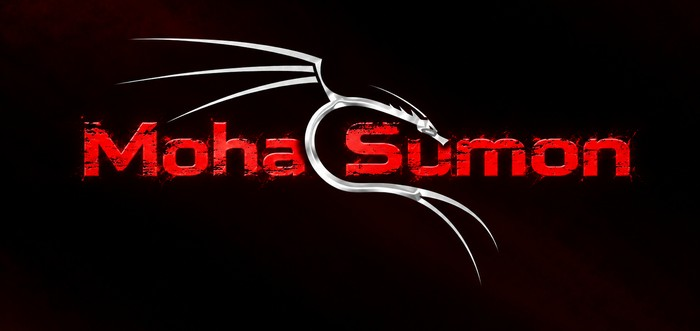

<p align="center">
  
</p>

<h1 align="center">🧰 Moha Tools</h1>

<p align="center">
  <b>Professional toolkit by Moha Sumon</b> — browser extensions, AI video tools & automation for content creators.
</p>

<p align="center">
  
  
  
  
</p>

---

## 📦 Tools — ki kaaj kore

| # | Tool | Folder | Ki kaaj |
|---|------|--------|---------|
| 1 | **Moha Page Pilot** `v1.4.6` | `extensions/moha-page-pilot` | All-in-one Facebook page automation suite — **bulk reel uploader** (multi-page, paced, identity-verified), **AI auto comment replies**, video downloader |
| 2 | **Moha Page Merge** `v1.0.7` | `extensions/moha-page-merge` | Facebook Page merge assistant — auto login detect, merge pair auto-fill, request tracker, WhatsApp help |
| 3 | **Moha Sumon Downloader** `v1.3.0` | `extensions/moha-downloader-dola` | Dola AI video downloader — **1080P, no watermark**, up to 120 min |
| 4 | **Moha Downloader** `v1.0.8` | `extensions/moha-downloader-yt` | Universal video downloader — floating button, network stream capture, HLS merging, original HD quality, no watermark |
| 5 | **Moha Sumon Seedance 30s** | `extensions/moha-sumon-seedance-30s` | Seedance 2.5 package — 30-second AI videos from text or image |
| 6 | **Video Prompt Architect** | `skills/video-prompt-architect` | Skill: turns any video idea / reference video into production-grade AI video prompts (Sora, Runway, Kling, Pika, Luma) — auto 30s segmentation, 9:16 viral format |

> 🔒 Proti tool **password-protected zip** hishebe ache — official distribution archive. Extract korte PIN lagbe.

## 📁 Structure

```
moha-tools/
├── assets/                        # brand logo
├── extensions/                    # Chrome extensions (Manifest V3)
│   ├── moha-page-pilot/           # locked zip + README
│   ├── moha-page-merge/           # locked zip + README
│   ├── moha-downloader-dola/      # locked zip + README
│   ├── moha-downloader-yt/        # locked zip + README
│   └── moha-sumon-seedance-30s/   # locked zip + README
└── skills/
    └── video-prompt-architect/    # locked zip + README
```

## 🚀 Quick install (any extension)

1. Tool-er zip extract koro (PIN lagbe)
2. `chrome://extensions` → **Developer mode** ON
3. **Load unpacked** → extracted folder (jekhane `manifest.json` ache) select koro
4. Toolbar-e pin koro 📌

## 📞 Support

- 📘 Facebook: [Moha Sumon](https://web.facebook.com/ss.pappa.l/)
- 💬 WhatsApp: [+971526373563](https://wa.me/971526373563)

## © License

© Moha Sumon — all rights reserved. Free for personal use. Redistribution or resale without permission is not allowed.
